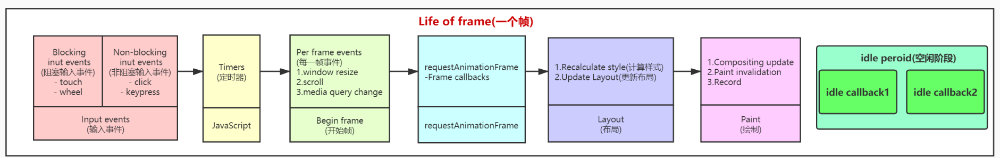

# 创建根节点

## react 的使用

main.jsx

```jsx
import { createRoot } from "react-dom/client";

let element = (
  <h1>
    hello <span style={{ color: "red" }}>world</span>
  </h1>
);
console.log(element);
const root = createRoot(document.getElementById("root"));

root.render(element);
```

## createRoot 实现

### react-dom/client.js

```js
export { createRoot } from "./src/client/ReactDOMRoot";
```

### react-dom/client/ReactDOMRoot.js

```js
import { createContainer } from "react-reconciler/src/ReactFiberReconciler";
// reconciler 协调器

/**
 *
 * @param {FiberRootNode的实例 } internalRoot
 */
function ReactDOMRoot(internalRoot) {
  this._internalRoot = internalRoot;
}

/**
 * 创建  react 根元素
 * @param {页面中的挂载dom元素} container
 * @returns
 */
export function createRoot(container) {
  //创建容器
  // @return {FiberRootNode} 返回FiberRootNode的实例
  const root = createContainer(container);

  return new ReactDOMRoot(root);
}
```

### react-reconciler/src/ReactFiberReconciler.js

```js
import { createFiberRoot } from "./ReactFiberRoot";

/**
 * 创建容器
 * @param {容器信息} containerInfo
 * @return {FiberRootNode} 返回FiberRootNode的实例
 */
export function createContainer(containerInfo) {
  // 创建fiber根元素
  return createFiberRoot(containerInfo);
}
```

### react-reconciler/src/ReactFiberRoot.js

```js
//简单来说 FiberRootNode = containerInfo 他的本质就是一个真实的容器DOM节点 div#root
//其实就是一个真实的DOM
function FiberRootNode(containerInfo) {
  this.containerInfo = containerInfo; //div#root
}

/**
 * 创建fiber根节点
 * @param {容器信息} containerInfo
 */
export function createFiberRoot(containerInfo) {
  const root = new FiberRootNode(containerInfo);

  return root;
}
```

# fiber

## 性能瓶颈

- JS 任务执行时间过长
  - 浏览器刷新频率为 60Hz,大概 16.6 毫秒渲染一次，而 JS 线程和渲染线程是互斥的，所以如果 JS 线程执行任务时间超过 16.6ms 的话，就会导致掉帧，导致卡顿，解决方案就是 React 利用空闲的时间进行更新，不影响渲染进行的渲染
  - 把一个耗时任务切分成一个个小任务，分布在每一帧里的方式就叫时间切片

## 屏幕刷新率

- 目前大多数设备的屏幕刷新率为 60 次/秒
- 浏览器渲染动画或页面的每一帧的速率也需要跟设备屏幕的刷新率保持一致
- 页面是一帧一帧绘制出来的，当每秒绘制的帧数（FPS）达到 60 时，页面是流畅的,小于这个值时，用户会感觉到卡顿
- 每个帧的预算时间是 16.66 毫秒 (1 秒/60)
- 1s 60 帧，所以每一帧分到的时间是 1000/60 ≈ 16 ms,所以我们书写代码时力求不让一帧的工作量超过 16ms

### 帧

- 每个帧的开头包括样式计算、布局和绘制
- JavaScript 执行 Javascript 引擎和页面渲染引擎在同一个渲染线程,GUI 渲染和 Javascript 执行两者是互斥的
- 如果某个任务执行时间过长，浏览器会推迟渲染

  
