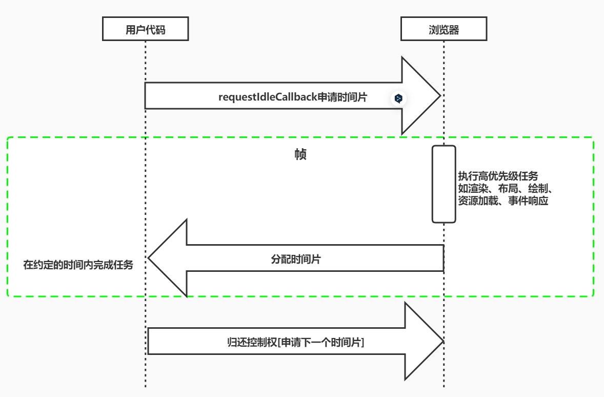
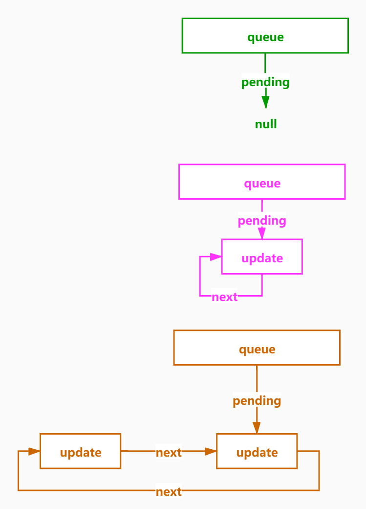

# 创建根节点

## react 的使用

main.jsx

```jsx
import { createRoot } from "react-dom/client";

let element = (
  <h1>
    hello <span style={{ color: "red" }}>world</span>
  </h1>
);
console.log(element);
const root = createRoot(document.getElementById("root"));

root.render(element);
```

## createRoot 实现

### react-dom/client.js

```js
export { createRoot } from "./src/client/ReactDOMRoot";
```

### react-dom/client/ReactDOMRoot.js

```js
import { createContainer } from "react-reconciler/src/ReactFiberReconciler";
// reconciler 协调器

/**
 *
 * @param {FiberRootNode的实例 } internalRoot
 */
function ReactDOMRoot(internalRoot) {
  this._internalRoot = internalRoot;
}

/**
 * 创建  react 根元素
 * @param {页面中的挂载dom元素} container
 * @returns
 */
export function createRoot(container) {
  //创建容器
  // @return {FiberRootNode} 返回FiberRootNode的实例
  const root = createContainer(container);

  return new ReactDOMRoot(root);
}
```

### react-reconciler/src/ReactFiberReconciler.js

```js
import { createFiberRoot } from "./ReactFiberRoot";

/**
 * 创建容器
 * @param {容器信息} containerInfo
 * @return {FiberRootNode} 返回FiberRootNode的实例
 */
export function createContainer(containerInfo) {
  // 创建fiber根元素
  return createFiberRoot(containerInfo);
}
```

### react-reconciler/src/ReactFiberRoot.js

```js
//简单来说 FiberRootNode = containerInfo 他的本质就是一个真实的容器DOM节点 div#root
//其实就是一个真实的DOM
function FiberRootNode(containerInfo) {
  this.containerInfo = containerInfo; //div#root
}

/**
 * 创建fiber根节点
 * @param {容器信息} containerInfo
 */
export function createFiberRoot(containerInfo) {
  const root = new FiberRootNode(containerInfo);

  return root;
}
```

# Fiber

## 性能瓶颈

- JS 任务执行时间过长
  - 浏览器刷新频率为 60Hz,大概 16.6 毫秒渲染一次，而 JS 线程和渲染线程是互斥的，所以如果 JS 线程执行任务时间超过 16.6ms 的话，就会导致掉帧，导致卡顿，解决方案就是 React 利用空闲的时间进行更新，不影响渲染进行的渲染
  - 把一个耗时任务切分成一个个小任务，分布在每一帧里的方式就叫时间切片

## 屏幕刷新率

- 目前大多数设备的屏幕刷新率为 60 次/秒
- 浏览器渲染动画或页面的每一帧的速率也需要跟设备屏幕的刷新率保持一致
- 页面是一帧一帧绘制出来的，当每秒绘制的帧数（FPS）达到 60 时，页面是流畅的,小于这个值时，用户会感觉到卡顿
- 每个帧的预算时间是 16.66 毫秒 (1 秒/60)
- 1s 60 帧，所以每一帧分到的时间是 1000/60 ≈ 16 ms,所以我们书写代码时力求不让一帧的工作量超过 16ms

## 帧

- 每个帧的开头包括样式计算、布局和绘制
- JavaScript 执行 Javascript 引擎和页面渲染引擎在同一个渲染线程,GUI 渲染和 Javascript 执行两者是互斥的
- 如果某个任务执行时间过长，浏览器会推迟渲染

  

## requestIdleCallback

- 我们希望快速响应用户，让用户觉得够快，不能阻塞用户的交互
- requestIdleCallback 使开发者能够在主事件循环上执行后台和低优先级工作，而不会影响延迟关键事件，如动画和输入响应
- 正常帧任务完成后没超过 16 ms,说明时间有富余，此时就会执行 requestIdleCallback 里注册的任务

  

```html
<!DOCTYPE html>
<html lang="en">
  <head>
    <meta charset="UTF-8" />
    <meta http-equiv="X-UA-Compatible" content="IE=edge" />
    <meta name="viewport" content="width=device-width, initial-scale=1.0" />
  </head>
  <body>
    <script>
      function sleep(d) {
        for (var t = Date.now(); Date.now() - t <= d; );
      }
      const works = [
        () => {
          console.log("第1个任务开始");
          sleep(20); //sleep(20);
          console.log("第1个任务结束");
        },
        () => {
          console.log("第2个任务开始");
          sleep(20); //sleep(20);
          console.log("第2个任务结束");
        },
        () => {
          console.log("第3个任务开始");
          sleep(20); //sleep(20);
          console.log("第3个任务结束");
        },
      ];

      requestIdleCallback(workLoop);
      function workLoop(deadline) {
        console.log("本帧剩余时间", parseInt(deadline.timeRemaining()));
        while (deadline.timeRemaining() > 1 && works.length > 0) {
          performUnitOfWork();
        }
        if (works.length > 0) {
          console.log(
            `只剩下${parseInt(
              deadline.timeRemaining()
            )}ms,时间片到了等待下次空闲时间的调度`
          );
          requestIdleCallback(workLoop);
        }
      }
      function performUnitOfWork() {
        works.shift()();
      }
    </script>
  </body>
</html>
```

## 从 react 中学习到的位运算在权限中的应用

```js
// 在 React 进行DOM DIFF 的时候 会计算要执行的操作

const Placement = 0b001; //1
const Update = 0b010; //2
let flags = 0b00;

// 增加操作

flags |= Placement;
flags |= Update;

console.log(flags.toString(2));
console.log(flags);

// 删除操作
flags = flags & ~Placement;
console.log(flags.toString(2));
console.log(flags);

// 判断是否包含

console.log((flags & Placement) === Placement);
console.log((flags & Update) === Update);
```

## 什么是 Fiber ？

为什么需要 Fiber？

- 我们可以通过某些调度策略合理分配 CPU 资源，从而提高用户的响应速度
- 通过 Fiber 架构，让自己的调和过程变成可被中断。 适时地让出 CPU 执行权，可以让浏览器及时地响应用户的交互

### Fiber 是一个执行单元

- Fiber 是一个执行单元,每次执行完一个执行单元, React 就会检查现在还剩多少时间，如果没有时间就将控制权让出去

### Fiber 是一种数据结构

React 目前的做法是使用的类链表的数据结构, 每个虚拟节点内部表示为一个 Fiber
从顶点开始遍历
如果有第一个儿子，先遍历第一个儿子
如果没有第一个儿子，标志着此节点遍历完成
如果有弟弟遍历弟弟
如果有没有下一个弟弟，返回父节点标识完成父节点遍历，如果有叔叔遍历叔叔
没有父节点遍历结束


### 创建根 fiber

#### react-reconciler/src/ReactFiberRoot.js

根容器的 `current` 指向当前的根 `fiber` ，根 `fiber` 的 `stateNode` 指向真实的 `DOM` 节点

```js
import { createHostRootFiber } from "./ReactFiber";

//简单来说 FiberRootNode = containerInfo 他的本质就是一个真实的容器DOM节点 div#root
//其实就是一个真实的DOM
function FiberRootNode(containerInfo) {
  this.containerInfo = containerInfo; //div#root
}

/**
 * 创建fiber根节点
 * @param {容器信息} containerInfo
 */
export function createFiberRoot(containerInfo) {
  const root = new FiberRootNode(containerInfo);

  //   HostRoot指的就是根节点 div#root
  const uninitializedFiber = createHostRootFiber();
  //   根容器的current指向当前的根fiber
  root.current = uninitializedFiber;
  // 根fiber的stateNode，也就是真是DOM节点指向
  uninitializedFiber.stateNode = root;
  return root;
}
```

#### react-reconciler/src/ReactFiber.js

```js
import { HostRoot } from "./ReactWorkTags";
import { NoFlags } from "./ReactFiberFlags";

/**
 *
 * @param {fiber的类型} tag 函数组件 0   类组件 1   原生组件 5 根元素3
 * @param {等待更新的props} pendingProps
 * @param {虚拟dom的key} key
 */
export function FiberNode(tag, pendingProps, key) {
  this.tag = tag;
  this.key = key;
  this.type = null; //fiber 类型， 来自于 虚拟DOM节点的type  span  div p

  //   每个虚拟DOM   =>  Fiber节点   =>  真实DOM

  this.stateNode = null; //此fiber对应的真实DOM节点  h1 => 真实的h1DOM

  this.return = null;
  this.child = null;
  this.sibling = null;
  // fiber 哪来的？ 通过虚拟DOM节点创建，虚拟DOM会提供pendingProps用来创建fiber节点的属性
  this.pendingProps = pendingProps; //等待生效的属性
  this.memoizedProps = null; //已经生效的属性

  //   每个fiber还会有自己的状态，每一种fiber 状态存的类型是不一样的
  // 类组件对应的fiber 存的就是类的实例的状态，HostRoot 存的就是要渲染的元素
  this.memoizedState = null;

  this.updateQueue = null;

  //   副作用标识，表示要针对此fiber节点进行何种操作
  this.flags = NoFlags;
  //   子节点对应的副作用标识 副作用 就是指 对DOM节点的操作
  this.subtreeFlags = NoFlags;

  // 替身， 轮替
  this.alternate = null;
}

export function createFiber(tag, pendingProps, key) {
  return new FiberNode(tag, pendingProps, key);
}

export function createHostRootFiber() {
  return createFiber(HostRoot, null, null);
}
```

#### react-reconciler/src/ReactFiberFlags.js

```js
export const NoFlags = 0b00000000000000000000000000;
export const Placement = 0b00000000000000000000000010;
export const Update = 0b00000000000000000000000100;
```

#### fiber 中的更新队列（循环链表）



```js
function initialUpdateQueue(fiber) {
  const queue = {
    shared: {
      pending: null, //永远指向最后一个更新
    },
  };
  fiber.updateQueue = queue;
}

function createUpdate() {
  return {};
}

function enqueueUpdate(fiber, update) {
  const updateQueue = fiber.updateQueue;
  const shared = updateQueue.shared;
  if (!shared.pending) {
    update.next = update;
  } else {
    update.next = shared.pending.next; // pending.next 指向的是第一个更新，这句的意思是 先把 第一个更新保留下来
    shared.pending.next = update; // 再让队尾的元素 指向 新入队的元素
  }
  //pending要指向最后一个更新，最后一个更新 next 指向第一个更新  --- 单向循环链表
  shared.pending = update;
}

function getStateFromUpdate(update, newState) {
  return Object.assign({}, newState, update.payload);
}

function processUpdateQueue(fiber) {
  const queue = fiber.updateQueue;
  const pending = queue.shared.pending;
  if (pending !== null) {
    queue.shared.pending = null;

    //最后一个更新
    const lastPendingUpdate = pending;
    //第一个更新
    const firstPendingUpdate = lastPendingUpdate.next;

    // 把环状链接剪开
    lastPendingUpdate.next = null;

    let newState = fiber.memoizedState;
    let update = firstPendingUpdate;
    while (update) {
      newState = getStateFromUpdate(update, newState);
      update = update.next;
    }
    fiber.memoizedState = newState;
  }
}

let fiber = { memoizedState: { id: 1 } };

initialUpdateQueue(fiber);

let update1 = createUpdate();
update1.payload = { name: "foo" };
enqueueUpdate(fiber, update1);
let update2 = createUpdate();
update2.payload = { age: 26 };
enqueueUpdate(fiber, update2);
processUpdateQueue(fiber);
console.log(fiber.memoizedState); //{ id: 1, name: 'foo', age: 26 }
```
